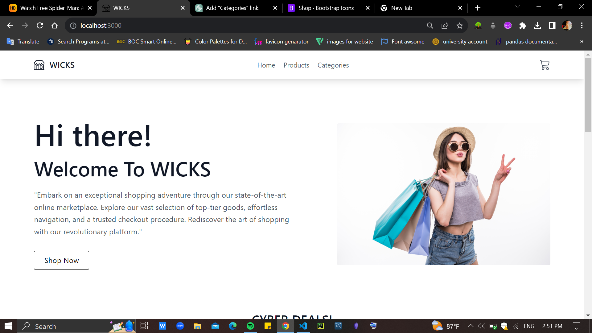
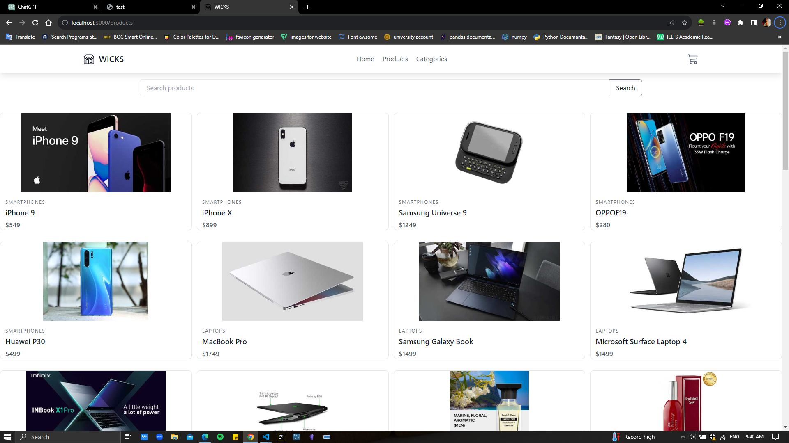
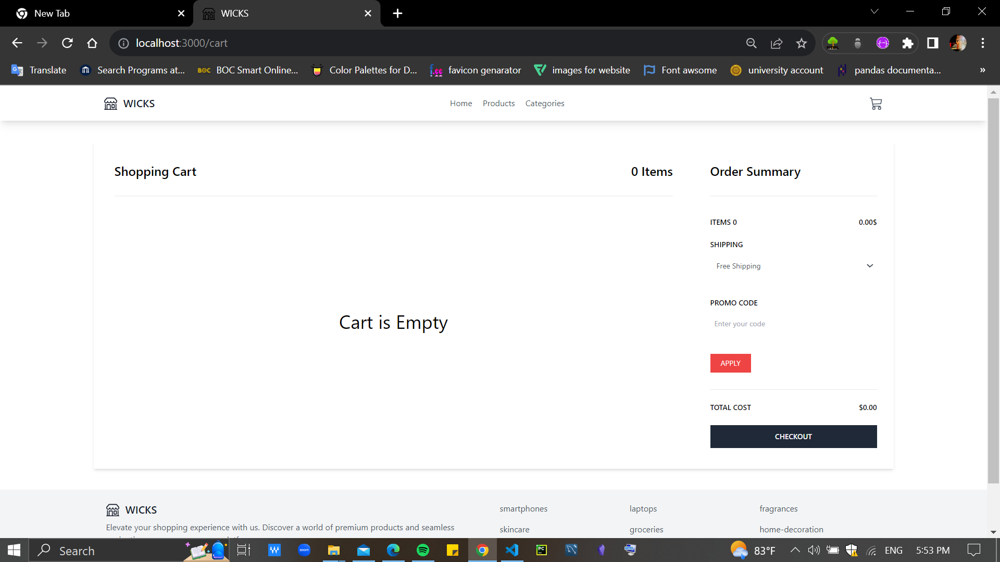

# Single-Page E-commerce Site Development using React JS

## site live at -: https://wicky2001.github.io/online_store/

## Table of Contents

- [Features](#features)
- [Usage](#usage)
- [Technologies Used](#technologies-used)
- [Screenshots](#screenshots)

## Features

- Display a list of products with pagination.
- Filter products by categories.
- Search for products using keywords.
- Add to Cart option.
- User-friendly interface with responsive design.

## Usage

1. Browse the list of products on the homepage.
2. Use the brand filter to narrow down products by brand.
3. Enter a search query and click the "Search" button to find products.
4. Navigate through pages using pagination buttons.
5. Add products to the cart for purchase.

## Technologies Used

- React
- Tailwind CSS
- JavaScript

## Screenshots

_Homepage showcasing the list of products._

_Search functionality for finding products by keywords._

_Cart view displaying selected products for purchase._

Feel free to explore the full functionality and visual appeal of the E-commerce site by referring to the provided screenshots.
